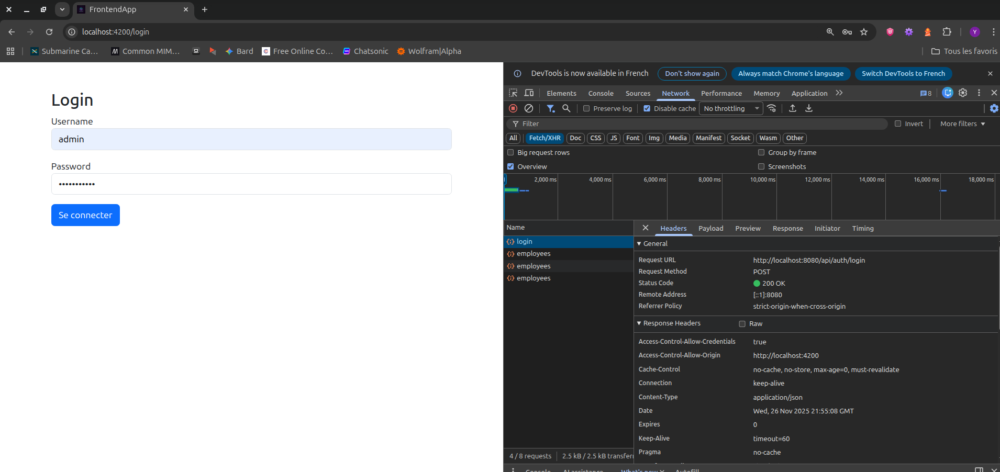
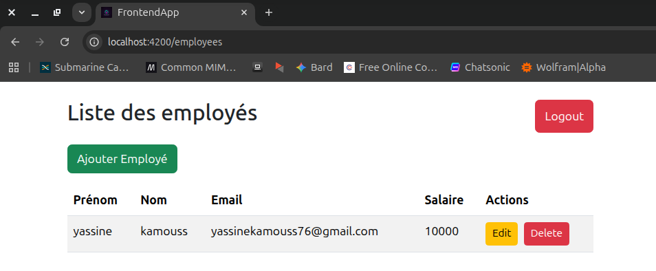

# 🏢 Système de Gestion des Employés (Frontend)


Bienvenue dans le frontend de l'application de gestion des employés. Ce projet est une **Single Page Application (SPA)** moderne construite avec **Angular 19**, offrant une interface utilisateur intuitive pour gérer les dossiers des employés de manière sécurisée et efficace.

---

## 📑 Table des matières

1. [Aperçu du projet](#-aperçu-du-projet)
2. [Fonctionnalités](#-fonctionnalités)
3. [Technologies utilisées](#-technologies-utilisées)
4. [Architecture & Structure](#-architecture--structure)
5. [Prérequis](#-prérequis)
6. [Installation](#-installation)
7. [Configuration](#-configuration)
8. [Utilisation](#-utilisation)
9. [Captures d'écran](#-captures-décran)

---

## 🔭 Aperçu du projet

Cette application sert d'interface client pour le système de gestion des employés. Elle permet aux utilisateurs authentifiés de consulter, créer, modifier et supprimer des informations sur les employés. 

L'application communique avec une API backend Spring Boot (par défaut sur `http://localhost:8080`) et gère l'authentification via des **jetons JWT** (JSON Web Tokens).

## ✨ Fonctionnalités

### 🔐 Authentification & Sécurité
- **Login** : Interface de connexion sécurisée.
- **JWT** : Gestion automatique des tokens (stockage dans `localStorage`).
- **AuthGuard** : Protection des routes sensibles (redirection vers login si non connecté).
- **Intercepteur HTTP** : Injection automatique du token Bearer dans chaque requête sortante.

### 👥 Gestion des Employés (CRUD)
- **Consulter** : Affichage des employés dans un tableau responsive.
- **Ajouter** : Formulaire de création avec validation des champs.
- **Modifier** : Édition des informations existantes (Salaire, Nom, Email, etc.).
- **Supprimer** : Retrait définitif avec confirmation.

## 🛠 Technologies utilisées

- **Framework** : [Angular 19](https://angular.io/) (Architecture Standalone Components)
- **Langage** : [TypeScript](https://www.typescriptlang.org/)
- **Style & UI** : [Bootstrap 5](https://getbootstrap.com/)
- **Asynchrone** : [RxJS](https://rxjs.dev/) (Observables)
- **Client HTTP** : Angular `HttpClient`

## 📂 Architecture & Structure

Le projet suit l'architecture moderne "Standalone" d'Angular (sans `AppModule`).

```bash
src/
├── app/
│   ├── app.config.ts   # Config globale (Router, HTTP providers)
│   ├── app.routes.ts   # Définition des routes
│   ├── core/           # Cœur de l'application (Sécurité)
│   │   ├── auth.guard.ts       # Protection des routes
│   │   └── auth.interceptor.ts # Intercepteur JWT
│   ├── models/         # Interfaces TypeScript
│   │   ├── employee.ts
│   │   └── auth-response.ts
│   ├── pages/          # Vues principales (Composants)
│   │   ├── login/
│   │   ├── employee-list/
│   │   └── employee-form/
│   └── services/       # Logique métier et appels API
│       ├── auth.service.ts
│       └── employee.service.ts
├── assets/             # Images (logos, screenshots)
└── index.html  
```

## 📋 Prérequis

Avant de commencer, assurez-vous d'avoir installé :

- **Node.js** (version 18 ou supérieure recommandée)
- **npm** (gestionnaire de paquets Node)
- **Angular CLI** (`npm install -g @angular/cli`)

## 🚀 Installation

1.  **Cloner le dépôt** :

    ```bash
    git clone https://github.com/votre-utilisateur/frontend-app.git
    cd frontend-app
    ```

2.  **Installer les dépendances** :
    ```bash
    npm install
    ```

## 🚀 Configuration
Par défaut, l'application pointe vers `http://localhost:8080/api`. Si vous devez changer l'URL du backend, modifiez les fichiers suivants dans src/app/services/ :
- `auth.service.ts`
- `employee.service.ts`

```typescript
// Exemple
private apiUrl = 'http://votre-nouvelle-ip:8080/api/...';
```


## ▶️ Utilisation

### Serveur de développement

Pour lancer le serveur de développement et voir l'application en action :

```bash
ng serve
```

Ouvrez votre navigateur et naviguez vers `http://localhost:4200/`. L'application se rechargera automatiquement si vous modifiez les fichiers sources.

### Construction (Build)

Pour construire le projet pour la production :

```bash
ng build
```

Les artefacts de construction seront stockés dans le répertoire `dist/`.

### Tests

Pour exécuter les tests unitaires via [Karma](https://karma-runner.github.io) :

```bash
ng test
```


## Captures d'écran
### Page de Connexion

Une interface simple et sécurisée pour accéder à l'application.





### Gestion des Employés

Le tableau de bord principal permettant de visualiser et gérer la liste des employés.




---
Développé par Yassine Kamouss - 2025